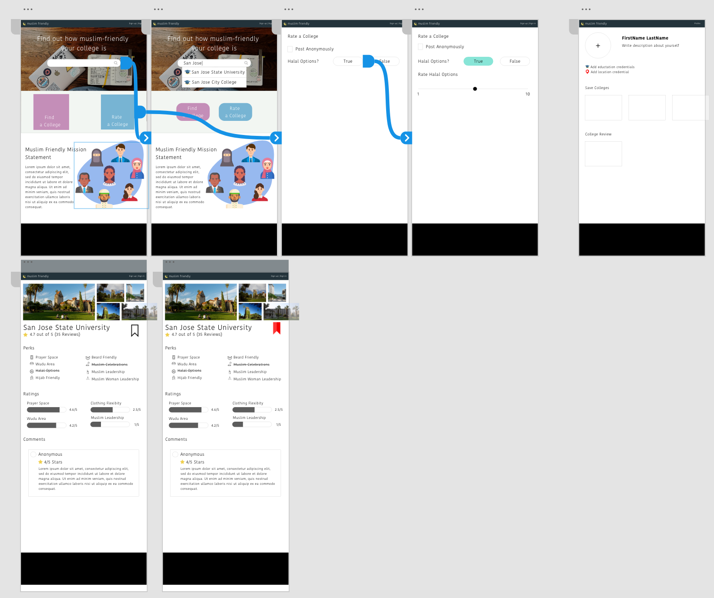
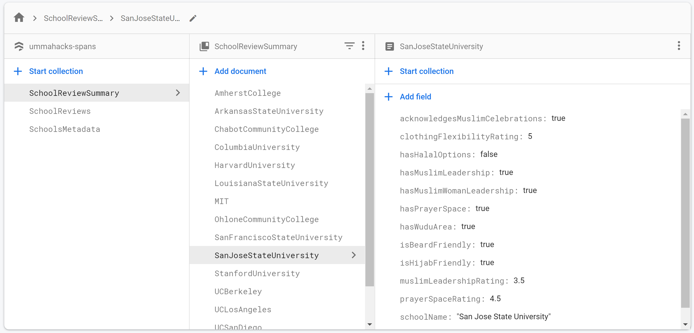

# ummahacks-spans
# Muslim Friendly

MuslimFriendly is dedicated to bringing transparency in Muslim inclusivity at colleges, universities, and workplaces worldwide.

## Table of Contents
1. [Overview](#Overview)
1. [User Stories](#User-Stories)
1. [Wireframes](#Wireframes)
1. [Schema](#Schema)

## Overview
### Description
Muslim-friendly is a platform that allows Muslims to voice opinions about the "muslim-friendliness" of their colleges. The college reviews are intentioned to help incoming freshmen make informed decisions about their choice of college by providing them insight into the place's culture. Ratings for each college are calculated holistically; the presence--as well as the quality--of facilities such as prayer rooms and wudu areas, in addition to accommodations such as halal food options, are considered.

## User Stories
### User searches for a school's ratings

User lands on the splash screen for muslimfriendly.fyi and reads through the mission statement
<add screenshot>

User searches for a specific school through the search bar
<add screenshot>

User selects a school from the autocomplete drop-down and is directed to a page containing information about that school
<add screenshot>

User views the ratings for a school
<add screenshot>

### User submits a rating for a school

User searches for a specific school through the search bar
<add screenshot>

User selects a school from the autocomplete drop-down and is directed to a page containing information about that school
<add screenshot>

User selects the option to add a rating for the displayed school
<add screenshot>

User is prompted to login, if he/she isn't already logged in
<add screenshot>

User enters information in the ratings form about the school
<add screenshot>

User submits the ratings
<add screenshot>

User sees the confirmation screen
<add screenshot>

### User logs in to his/her profile

User lands on the splash screen for muslimfriendly.fyi

User uses the buttons from the top menu to begin logging in

User is prompted for his/her login credentials

User is logged in, if the credentials are correct

User is prompted to re-enter information if credentials are incorrect

## Wireframes

## Schema

